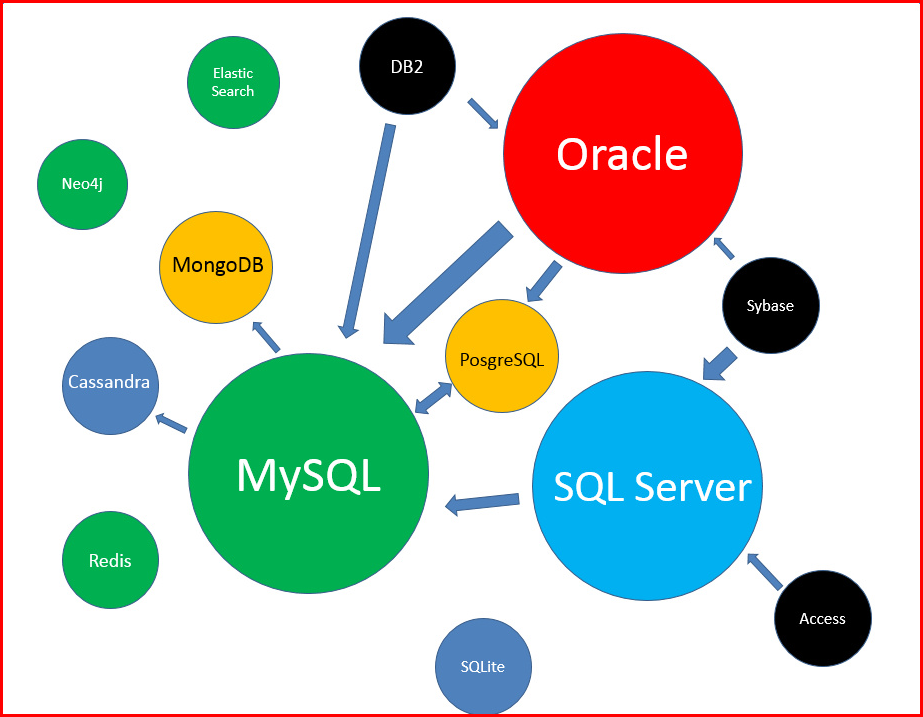
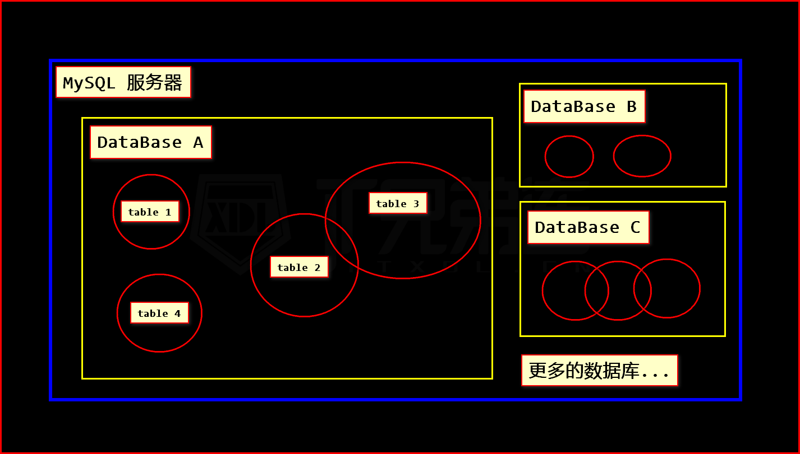

# 数据库MySQL

## 1. 数据库简介

### 1.1 数据库是什么？

 数据库是一种数据存储和管理的高效方式。

### 1.2 主流数据库分类

- Oracle     (甲骨文，全球第二大软件公司)

- MySQL      (免费开源)

- SQL Server (Microsoft)

- MongoDB    (非关系型数据库)

- PostgreSQL (加州大学伯克利分校，对象关系数据库)

- DB2        (IBM 公司开发出来操作)

- Redis      (key-value的形式存储)

- SQLite     (微型数据库)

  

### 1.3 MySQL 关系型数据库

由瑞典 MySQL AB 公司开发，目前属于 Oracle 旗下产品。

MySQL 是一种关系数据库管理系统，关系数据库将数据保存在不同的表中，而不是将所有数据放在一个大仓库内，这样就增加了速度并提高了灵活性。

MySQL 所使用的 `SQL` 语言是用于访问数据库的最常用`标准化语言`。
MySQL 软件采用了双授权政策，分为`社区版`和`商业版`，由于其体积小、速度快、总体拥有成本低，尤其是开放源码这一特点，一般中小型网站的开发都选择 MySQL 作为网站数据库。

LAMP 中的 `M` 一般指的就是 MySQL，特点就是 开源免费。

> 什么是关系型数据库？
> 详见 `关系型数据库.xlsx` 文件。

### 1.4 SQL 语言

> SQL 是用于 访问和处理数据库的 标准的计算机语言。

我们将学习，如何使用 SQL 访问和处理数据系统中的数据
它可操作的数据库，包括但不限于：MySQL，Oracle，Sybase，SQL Server，DB2， Access 等等这些。

- SQL
  - Structured Query Language 结构化查询语言
  - 用于访问和处理 数据库的标准的计算机语言
- DDL Data Definition Language 数据定义语言
  - CREATE 创建
  - ALTER 修改
  - DROP 删除
  - 对库/表的操作
- DML
  - Data Manipulation Language 数据操作语言
  - INSERT 插入数据
  - DELETE 删除数据
  - UPDATE 更新数据
  - SELECT 查询数据
  - 对数据的操作
- DCL
  - Data Control Language 数据控制语言
  - GRANT 分配权限
  - REVOKE 收回权限
  - 行为操作

## 2. mysql安装及配置

> 详见 `install` 目录的安装文档 `readme.md`

### 2.1 mysql登录和退出

```mysql
mysql 登录参数说明：
    -h  主机名 localhost
    -u  用户名 root
    -p  密码   123456
    注意：参数无需加空格，直接写值即可。

对比说明，以下命令的区别：
$ mysql -hlocalhost -uroot -p123456
$ mysql -uroot -p123456
$ mysql -uroot -p
```

密码可以写和不写的区别一个是明文，另一个是密文。初始无任何设置用户应该是root，无密码，以后可以修改。

推出命令：\q, quit, exit

### 2.1.1 登录信息说明

```mysql
# 欢迎来到 Mysql 监控，命令结束符 使用 分号 或 \g
Welcome to the MySQL monitor.  Commands end with ; or \g.
# 你的第 x 次 MySQL 数据库连接，每次开机从 0 开始
Your MySQL connection id is 55
# MYSQL版本，社区版本
Server version: 5.7.23 MySQL Community Server (GPL)
# 版权所有，甲骨文及其附属公司保留所有权利
Copyright (c) 2000, 2018, Oracle and/or its affiliates. All rights reserved.
# 商标所有权说明
Oracle is a registered trademark of Oracle Corporation and/or its
affiliates. Other names may be trademarks of their respective
owners.
# 帮助信息 help 或 \h 。
# \c 清除当前的输入状态，清除当前未执行的命令
Type 'help;' or '\h' for help. Type '\c' to clear the current input statement.
```

总结以上得到：

1. 每个 SQL 命令，都需要使用 `;`(分号) 或 `\g` 来完成
2. 可以将一行命令 拆成多行
3. 可以通过`\c` 来取消 本行命令
4. 可以通过`\q`、`exit`、`quit`来退出当前客户端

> 此外，我们还能通过使用`help`命令，来查询快捷键

常用如下：

- `\G` 将命令发送到 mysql 服务器，以行方式 显示结果
  - DOS窗口有宽度,查询结果 出现的位置 会比较乱.
  - 要想正常查看 结果的内容,可用 \G 来按行输出.
  - \G后就不用加分号了，它本身也是一种结束符.
- `\c` 取消当前未完成的操作
- `\q` 退出当前客户端
- `\s` 显示当前服务器状态
- `\h` (同help命令) 显示帮助信息
- `\d` 更改执行符

> MySQL系统命令，不区分大小写。
>
> 为了方便区分，MySQL 命令建议大写，
>
> 自己定义的库名、表名、字段名等等，建议小写。

## 3. 数据库和数据表

首先，我们要明确一个概念：



### 3.1 数据库的增删查

1. 查看当前服务器有多少数据库

```
# 查看数据库们
mysql> SHOW DATABASES;

# 返回类似 以下信息：
+--------------------+
| Database           |
+--------------------+
| information_schema |
| mysql              |
| test               |
+--------------------+
3 rows in set (0.00 sec)
```

2. 创建数据库

   ```mysql
   # IF NOT EXISTS：数据库不存在 才创建（可选）
   mysql> CREATE DATABASE IF NOT EXISTS `库名`;
   
   CREATE DATABASE IF NOT EXISTS `s91`;
   
   > Query OK, 1 row affected (0.02 sec)
   ```

3. 删除数据库

   ```mysql
   # IF EXISTS：数据库存在 才删除（可选）
   mysql> DROP DATABASE IF EXISTS `库名`;
   
   DROP DATABASE IF EXISTS `s91`;
   
   > Query OK, 0 rows affected (0.02 sec)
   ```

4. 选择数据库(要进入一个表必须选择一个库)

   ```mysql
   # 选择数据库
   mysql> USE `库名`;
   
   USE `s91`;
   
   > Database changed
   # 要使用数据库,就必须先选择某个数据库。
   
   # 查看当前选中的库
   select database();
   ```

​       **warning:数据库的名字一旦指定便无法更改，请慎重！**

### 3.2  数据表的增删改查

#### 3.2.1 查看数据表（有多少个）

```mysql
# 查看数据表
mysql> SHOW TABLES;

# 无数据表，则返回
> Empty set (0.00 sec)

# 有数据表，则输出数据表表名
+----------------+
| Tables_in_test |
+----------------+
| user           |
+----------------+
1 rows in set (0.00 sec)
```

#### 3.2.2 创建数据表

```mysql
# 创建数据表语法
CREATE TABLE IF NOT EXISTS `表名`(
    # 字段及属性
)ENGINE=InonDB DEFAULT CHARSET=UTF8mb4;

# 创建 user 表
CREATE TABLE IF NOT EXISTS `user`(
    `id`    INT,
    `name`  VARCHAR(255),
    `sex`   TINYINT,
    `age`   TINYINT UNSIGNED,
    `tel`   CHAR(11)
)ENGINE=InnoDB DEFAULT CHARSET=UTF8mb4;

> Query OK, 0 rows affected (0.06 sec)
```

> 欲知具体规则，请听下回分解~

#### 3.2.3 查看表结构

```mysql
# 查看数据表 表结构方式一：
mysql> DESC `表名`;

DESC `user`;

+-------+---------------------+------+-----+---------+-------+
| Field | Type                | Null | Key | Default | Extra |
+-------+---------------------+------+-----+---------+-------+
| id    | int(11)             | YES  |     | NULL    |       |
| name  | varchar(255)        | YES  |     | NULL    |       |
| sex   | tinyint(4)          | YES  |     | NULL    |       |
| age   | tinyint(3) unsigned | YES  |     | NULL    |       |
| tel   | char(11)            | YES  |     | NULL    |       |
+-------+---------------------+------+-----+---------+-------+
5 rows in set (0.00 sec)


# 查看数据表 表结构方式二：
mysql> DESC `表名`\G

DESC `user`\G

*************************** 1. row ***************************
  Field: id
   Type: int(11)
   Null: YES
    Key:
Default: NULL
  Extra:
# [...省略中间部分...]
*************************** 5. row ***************************
  Field: tel
   Type: char(11)
   Null: YES
    Key:
Default: NULL
  Extra:
5 rows in set (0.00 sec)


# 查看数据表 表结构方式三：
mysql> DESCRIBE `表名`;

DESCRIBE `user`;
# 结果同第一种方式一致。

# 查看数据表 表结构方式四：
mysql> SHOW CREATE TABLE `表名`\G

SHOW CREATE TABLE `user`\G

*************************** 1. row ***************************
       Table: user
Create Table: CREATE TABLE `user` (
  `id` int(11) DEFAULT NULL,
  `name` varchar(255) DEFAULT NULL,
  `sex` tinyint(4) DEFAULT NULL,
  `age` tinyint(3) unsigned DEFAULT NULL,
  `tel` char(11) DEFAULT NULL
) ENGINE=InnoDB DEFAULT CHARSET=utf8
1 row in set (0.00 sec)
```

#### 3.2.4 删除数据表

```mysql
# 删除数据表
mysql> DROP TABLE IF EXISTS `表名`;

DROP TABLE IF EXISTS `user`;

> Query OK, 0 rows affected (0.02 sec)
```


## 4. 数据记录的CURD

> CURD 是一个数据库技术中的缩写词，一般的项目开发的各种参数的基本功能都是 CURD。
>
> 它代表 创建（Create）、 更新（Update） 、 读取（Read） 和 删除（Delete） 操作。

## 4.1 添加数据

### 4.1.1 添加单条数据

```mysql
# 字段名 使用反引号包裹，插入的值 使用单/双引号包裹

# 1). 为表的 【所有字段】 插入数据
# 必须列出所有 字段的值
mysql> INSERT INTO `表名` VALUES ('值1','值2'...'值N');

# 列出所有 字段 和 值，根据指定的 字段顺序，赋值相应的 字段值
mysql> INSERT INTO `表名` (`字段1`,`字段2`...`字段N`) VALUES ('值1','值2'...'值N');

# 2). 为表的 【指定字段】 插入数据
# 根据指定的 字段顺序，赋值相应的 字段值
mysql> INSERT INTO `表名` (`字段1`,`字段2`) VALUES ('值1','值2');
```

### 4.1.2 添加多条数据

```mysql
# 列出所有的 字段的值，多个值之间 用逗号隔开。
mysql> INSERT INTO `表名` VALUES
('值1','值2'...'值N'),
('值1','值2'...'值N'),
('值1','值2'...'值N');

# 指定字段的 多条插入
mysql> INSERT INTO `表名` (`字段1`,`字段2`) VALUES
('值1','值2'),
('值1','值2'),
('值1','值2');

# 将查询结果插入到表中
mysql> INSERT INTO `表名1` (字段列表1) SELECT 查询字段列表 FROM `表名2` [WHERE 条件表达式];
```

## 4.2 查询数据 (基本版)

```mysql
# 查询某表 全部的数据
mysql> SELECT * FROM `表名`;

# 查询某表中 某些字段的数据
mysql> SELECT `字段1`,`字段2` FROM `表名`;

# 查询指定记录
mysql> SELECT `字段1`,`字段2` FROM `表名` WHERE `字段`='值';
```

>详细版见`查询数据`

## 4.3 更新数据

```mysql
# 更新满足条件数据的字段值
mysql> UPDATE `表名`
SET `字段1`='新值1',`字段2`='新值2'...`字段N`='新值N'
WHERE 条件表达式;

# PS. 更新数据，一定要设置"WHERE"条件，否则更新整表数据！！
```

## 4.4 删除数据

### 4.4.1 删除指定数据

```mysql
# 删除满足条件的数据
mysql> DELETE FROM `表名` WHERE 条件表达式;  --不会删除主键自增计数器

# 删除数据，一定要设置"WHERE"条件，否则删除整表数据！！
# 删除数据，一定要设置"WHERE"条件，否则删除整表数据！！
# 删除数据，一定要设置"WHERE"条件，否则删除整表数据！！
```

### 4.4.2 清空表数据

```mysql
TRUNCATE TABLE `表名`; --会删除主键自增计数器，重新计数
```

# 5. 导入/导出 数据表

> 此操作需要在`没有登录 MySQL`的状态下进行。

## 5.1 导出数据

```shell
# 导出 指定数据库
$ mysqldump -u用户名 -p  库名 > 保存SQL文件.sql
# 密码会在 回车后输入

# 导出 指定数据库里 指定的表
$ mysqldump -u root -p 库名 表名1 表名2 > Backup.sql
```

## 5.2 导入数据

```shell
$ mysql -u用户名 -p 库名 < SQL文件.sql
```

## 5.3 使用工具操作 导入/导出

还可以使用软件或工具，来便捷的实现数据导入/导出操作

- [phpMyAdmin](https://www.phpmyadmin.net/)
- [Navicat](https://www.navicat.com.cn/)
- IEDA 编辑器

# 6. 修改用户名和密码

登陆 MySQL 修改 root 密码（WAMP 默认是无密码）
其原理就是替换 `mysql`.`user` 中 `root` 用户的密码字段值

## 6.1 可以登陆时 正常修改密码

```mysql
# 登陆 MySQL
$ mysql -u root -p

# 使用 mysql 数据库
mysql> use mysql;

# 新密码必须使用`password()`加密函数 进行加密，并更新到 mysql 数据库的密码字段

# MySQL 5.7 以前版本，密码字段为 Password
mysql> UPDATE `user` SET `Password`=password('new_password') WHERE `user`='root';

# MySQL 5.7 以后版本，Password 字段改为了 authentication_string
mysql> UPDATE `user` SET `authentication_string`=password('new_password') WHERE `user`='root';

# 刷新 MySQL 的系统权限相关表
mysql> flush privileges;

# 退出
mysql> exit;
```

## 6.2 无法登陆时 强制修改

1. 关闭 MySQL 服务
2. 打开 DOS 窗口，进入到 MySQL 下的 **`bin`**目录
3. 输入执行**`mysqld --skip-grant-tables` **
   - 意思为，启动 MySQL 服务的时候，跳过权限表认证，即跳过密码验证
   - 此时 DOS 窗口 已经不能动了，它已经占用 3306 端口了
   - 此窗口**`勿关`**
4. 再开一个 DOS 窗口，输入**`mysql`**回车，如果执行成功，将出现 MySQL 提示符
5. 选择连接权限数据库 **`use mysql`**
   - 可以输入 `select * from user\G` 查看`user`内的数据情况
6. 强制修改密码：
   - 5.7+（注意修改你的新密码）
     - **`UPDATE user SET authentication_string=password("你的新密码") WHERE user="root";`**
   - 5.7-（注意修改你的新密码）
     - `UPDATE user SET password=password("你的新密码") WHERE user="root";`
7. 刷新权限：**`flush privileges;`**
8. 退出所有DOS窗口，并**重启 MySQL 服务**，使用新密码登录

## 6.3 修改用户名

```mysql
# 登陆 MySQL
$ mysql -u root -p

# 使用 mysql 数据库
mysql> use mysql;

#比起修改密码大同小异，注意不用加密函数password() 
mysql> UPDATE `user` SET `user`='new_user' WHERE `user`='old_user';
```

