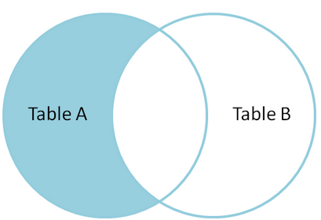

# 数据库

# 1. MySQL 事务

## 1.1 事务的概念

### 基本定义
> 事务是用来维护数据库的完整性，它保证成批的操作要么完全执行，要么完全不执行。
>
> 可以理解为：
>
> - 将多条 SQL操作(增删改)，作为一个 整体单元 来操作，
>
> - 都执行成功 则成功，有一条失败 则都失败.

### 表引擎说明

- `MyISAM`   不支持事务  表锁机制
- `InnoDB`   支持事务    行锁机制

> 锁定机制 是为了防止数据表的p取。


## 1.2 事务操作

- `begin`或`START TRANSACTION`  开启一个事务的回滚点
- `rollback` 回滚一个事务，回到 begin 之前的状态
- `commit`   提交一个事务，只有被提交的事务，才会被写入表中

> 在 MySQL 的默认设置下，事务都是自动提交的！
> 即执行 SQL 语句后就会马上执行 COMMIT 操作。
> 因此要显式地开启一个事务务须使用命令 BEGIN，用来禁止使用当前会话的自动提交。

```mysql
# 测试事务
# 创建`sw_test`表:
CREATE TABLE `sw_test`(
    `id` INT AUTO_INCREMENT NOT NULL PRIMARY KEY,
    `value` INT UNSIGNED
)ENGINE=InnoDB DEFAULT CHARSET=UTF8;

# 插入测试数据:
INSERT INTO `sw_test` (`value`) VALUES ('500');
INSERT INTO `sw_test` (`value`) VALUES ('500');

# 开启事务
begin;
-- 或者 START TRANSACTION;

# 修改数据
UPDATE `sw_test` SET `value`=value+100 WHERE `id`='2';
# 查询数据情况:
SELECT * FROM `sw_test`;

# 强制结束 DOS 操作（模拟断电）
# 重新登录MySQL，查询数据情况
SELECT * FROM `sw_test`;

-----
# 再次开启事务
begin;

# 修改数据
UPDATE `sw_test` SET `value`=value+100 WHERE `id`='2';
UPDATE `sw_test` SET `value`=value-100 WHERE `id`='1';

# 提交事务
commit;

# 查询数据情况
SELECT * FROM `sw_test`;

## 测试 rollback 操作
```

----

# 2. 查询数据

## 0. 数据准备
```mysql
# 新建用户表
CREATE TABLE IF NOT EXISTS `user`(
    `id` INT UNSIGNED AUTO_INCREMENT PRIMARY KEY,
    `name` VARCHAR(255) UNIQUE NOT NULL,
    `sex` TINYINT UNSIGNED NOT NULL DEFAULT 0,
    `age` TINYINT UNSIGNED NOT NULL DEFAULT 0,
    `province` VARCHAR(255) NOT NULL DEFAULT ''
)ENGINE=InnoDB DEFAULT CHARSET=utf8mb4;

# 查看表结构
DESC user;

+----------+---------------------+------+-----+---------+----------------+
| Field    | Type                | Null | Key | Default | Extra          |
+----------+---------------------+------+-----+---------+----------------+
| id       | int(10) unsigned    | NO   | PRI | NULL    | auto_increment |
| name     | varchar(255)        | NO   | UNI | NULL    |                |
| sex      | tinyint(3) unsigned | NO   |     | 0       |                |
| age      | tinyint(3) unsigned | NO   |     | 0       |                |
| province | varchar(255)        | NO   |     |         |                |
+----------+---------------------+------+-----+---------+----------------+
5 rows in set


# 添加测试数据
INSERT INTO `user` VALUES ('1', '黄超', '1', '18', '江苏');
INSERT INTO `user` VALUES ('2', '麦克雷', '1', '40', '纽约');
INSERT INTO `user` VALUES ('3', '卢西奥', '1', '17', '纽约');
INSERT INTO `user` VALUES ('4', '半藏', '1', '38', '东京');
INSERT INTO `user` VALUES ('5', '法老之鹰', '0', '30', '江苏');
INSERT INTO `user` VALUES ('6', '安娜', '0', '80', '江苏');
INSERT INTO `user` VALUES ('7', '天使', '0', '30', '江苏');
INSERT INTO `user` VALUES ('8', '查莉娅', '0', '36', '浙江');
INSERT INTO `user` VALUES ('9', '黑百合', '0', '32', '上海');
INSERT INTO `user` VALUES ('10', '猎空', '0', '18', '北京');
INSERT INTO `user` VALUES ('11', '狂鼠', '1', '40', '新疆');
INSERT INTO `user` VALUES ('12', '托比昂', '1', '50', '新疆');
INSERT INTO `user` VALUES ('13', 'D.Va', '0', '17', '上海');
INSERT INTO `user` VALUES ('14', '源氏', '1', '35', '东京');
INSERT INTO `user` VALUES ('15', '死神', '1', '40', '纽约');
INSERT INTO `user` VALUES ('16', '士兵76', '1', '40', '纽约');
INSERT INTO `user` VALUES ('17', '堡垒', '1', '99', '纽约');
INSERT INTO `user` VALUES ('18', '老王', '2', '40', '隔壁的');
INSERT INTO `user` VALUES ('19', '小美', '0', '16', '北京');
INSERT INTO `user` VALUES ('20', '莱因哈特', '1', '80', '纽约');
INSERT INTO `user` VALUES ('21', '路霸', '1', '43', '上海');
INSERT INTO `user` VALUES ('22', '温斯顿', '2', '20', '上海');
INSERT INTO `user` VALUES ('23', '秩序之光', '0', '19', '上海');
INSERT INTO `user` VALUES ('24', '小王', '1', '40', '北京');
INSERT INTO `user` VALUES ('25', '小王八', '1', '4', '纽约');
INSERT INTO `user` VALUES ('26', '小霸王', '1', '4', '上海');
INSERT INTO `user` VALUES ('27', '王尼玛', '1', '40', '深圳');
INSERT INTO `user` VALUES ('28', '王老五', '2', '28', '江苏');
INSERT INTO `user` VALUES ('29', '王麻子', '2', '99', '四川');
INSERT INTO `user` VALUES ('30', '王中王', '1', '60', '贵州');
INSERT INTO `user` VALUES ('31', '王守义', '1', '50', '四川');
INSERT INTO `user` VALUES ('32', '王老吉', '2', '88', '江苏');
INSERT INTO `user` VALUES ('33', '王二', '0', '8', '江苏');
INSERT INTO `user` VALUES ('34', '王全富贵', '1', '19', '上海');

----
# 创建`user2`表，和`user`表的结构一模一样
CREATE TABLE `user2` LIKE `user`;

# 给`user`表中写入 查出的数据
INSERT INTO `user2` (`id`,`name`,`sex`,`age`,`province`) (SELECT * FROM `user` WHERE `id`<'5');
```

## 1. 基本查询语句

```mysql
# 基本公式
SELECT 字段列表
FROM 表名
    [WHERE 条件表达式]
    [GROUP BY 字段名1 [HAVING 条件表达式2] ]
    [ORDER BY 字段名2 [ASC|DESC]]
    [LIMIT]
```

## 2. 单表查询

### 2.1 查询所有字段

```mysql
# 使用 * 查询所有字段
SELECT * FROM 表名;

# 列出所有字段
SELECT 字段列表 FROM 表名;

```

### 2.2 查询指定字段

```mysql
SELECT 字段1,字段2 FROM 表名;


```

### 2.3 查询指定记录

```mysql
SELECT 字段列表 FROM 表名 WHERE 条件表达式;


```

> WHERE 子句的条件：
> - 比较         `=` `<` `<=` `>` `>=` `!=` `<>`
> - 指定范围     `BETWEEN AND`、`NOT BETWEEN AND`
> - 指定集合     `IN`、`NOT IN`     
> - 匹配字符     `LIKE`、`NOT LIKE`
> - 是否为空值   `IS NULL`、`I`
> - `NOT NULL`
> - 多个条件查询 `AND`、`OR`

----------------------------------

### 2.4 带 IN 关键字查询

```mysql
SELECT 字段列表 FROM 表名 WHERE 字段名 [NOT] IN (元素1, 元素2, 元素N);


```

### 2.5 带 BETWEEN AND 的范围查询

```mysql
SELECT 字段列表 FROM 表名 WHERE 字段名 [NOT] BETWEEN 值1 AND 值2;


```

### 2.6 带 LIKE 的字符串匹配查询

```mysql
# LIKE 为模糊查询，按照模式去匹配字串内容
SELECT 字段 FROM 表名 WHERE 字段名 [NOT] LIKE '字符串';
# % : 表示 任意长度的字符串
# _ : 表示 单个字符


```

### 2.7 带 AND 的多条件查询

```mysql
# 类似于 逻辑与，AND左右的条件都成立，才能执行
SELECT 字段列表 FROM 表名 WHERE 条件表达式1 AND 条件表达式2 [... AND 条件表达式N];


```

### 2.8 带 OR 的多条件查询

```mysql
# 类似于 逻辑或，会执行 OR 条件中，条件成立的那个
SELECT 字段列表 FROM 表名 WHERE 条件表达式1 OR 条件表达式2 [... OR 条件表达式N];


```

### 2.9 查询结果不重复

```mysql
SELECT DISTINCT 字段列表 FROM 表名;
# 作用范围为 查询的全部字段，并不是 某一个字段


```

### 2.10 分组查询

#### 2.10.1 单独使用 GROUP BY 分组

```mysql
# 将查询结果 按照指定的字段分组
SELECT * FROM 表名 GROUP BY 字段名;

# 单独使用`GROUP BY` 只能显示每个分组的 第一条记录。
# 这样使用意义不大。因此，一般`GROUP BY`要配合 集合函数 使用才有效果


```
> MySQL 集合函数
> - `sum()`   求和
> - `min()`   最小值
> - `max()`   最大值
> - `avg()`   平均值
> - `count()` 统计个数
> - `group_concat()` 将分组结果 使用字串连接起来

#### 2.10.2 GROUP BY 与集合函数

```mysql
SELECT 字段名,COUNT(字段名) FROM 表名 GROUP BY 字段名;


```

#### 2.10.3 GROUP BY 与 GROUP_CONCAT() 函数

```mysql
SELECT 字段名,GROUP_CONCAT(字段名) FROM  表名 GROUP BY 字段名;


```

#### 2.10.4 GROUP BY与HAVING关键字一起使用

```mysql
SELECT 字段名 FROM 表名 GROUP BY 字段名 HAVING 条件;


```

### 2.11 对查询结果排序

```mysql
SELECT * FROM 表名 ORDER BY 字段名 [ASC|DESC];
# ASC  : 正序
# DESC : 倒序


```

### 2.12 用 LIMIT 限制查询结果的数量

#### 2.12.1 不指定初始值

```mysql
SELECT 字段名 FROM 表名 LIMIT 记录数;


```

#### 2.12.2 指定初始值

```mysql
SELECT 字段名 FROM 表名 LIMIT 初始位置(偏移量),记录数;
# LIMIT m,n   m - 偏移量 |  n - 记录数


```

### 2.13 为表或字段取别名

> 取别名并不是 更改其名称，是为了 方便对数据的 使用，别名仅当次有效。

#### 2.13.1 为字段取别名

```mysql
SELECT 字段名 [as] 别名 FROM 表名;


```

#### 2.13.2 为表取别名

```mysql
SELECT 字段名 FROM 表名 [as] 别名;


# 查询语句中,字段可指定表名:


```

## 3. 多表查询

```mysql
# 创建一个`lover`表
CREATE TABLE IF NOT EXISTS `lover`(
    `id` INT UNSIGNED AUTO_INCREMENT PRIMARY KEY,
    `name` VARCHAR(255) UNIQUE NOT NULL,
    `sex` TINYINT UNSIGNED NOT NULL DEFAULT 0,
    `user_id` INT UNSIGNED
)ENGINE=InnoDB DEFAULT CHARSET=UTF8MB4;

# 查看 表结构
DESC `lover`;

# 添加测试数据
INSERT INTO `lover` VALUES
(null, '小花','0','5'),
(null, '小草','1','3'),
(null, '如花','2','8'),
(null, '阿凤','0','5'),
(null, '阿玲','0','4'),
(null, '春哥','1','3'),
(null, '曾哥','1','3'),
(null, '芝芝','0','10'),
(null, '桐桐','2','13'),
(null, '静静','2','1'),
(null, '东施','0',''),
(null, '西施','0',''),
(null, '南施','0',''),
(null,0,'0','');

# 查询检测数据可用性
SELECT * FROM `lover`;

```

### 3.1 关联查询

```mysql
# 关联查询 可以查询两个或两个以上的表。
SELECT 表1.字段,表2.字段...
FROM 表1,表2
WHERE 表1.主键 = 表2.外键;

# 外键（foreign key） 
# 外键为某个表中的一列，它包含另一个表的主键值，定义了两个表之间的关系。

# 两表关系型查询
SELECT u.id uid, u.name uname, u.sex usex, l.id lid, l.name lname
FROM user u, lover l
WHERE u.id = l.user_id;

# 单表自身连接
(省市表/分类表)
SELECT c1.cname 顶级, c2.cname 二级
FROM category c1, category c2
WHERE c1.id = c2.pid AND c1.pid = 0;

SELECT c1.cname 顶级, c2.cname 二级, c3.cname 三级, c4.cname 四级
FROM category c1, category c2, category c3, category c4
WHERE c1.id = c2.pid AND c2.id = c3.pid AND c3.id = c4.pid
AND c1.pid = 0;

```

### 3.2 JOIN 查询 (连接查询)
> JOIN 查询，用于处理多表中字段之间的联系
>
> 一图胜万言！ 废话不多说，请收藏：


#### 3.2.0 JOIN 基本公式：

```mysql
SELECT 字段列表 
FROM A INNER|LEFT|RIGHT JOIN B 
ON 条件
[WHERE 条件 及其他]
```

#### 3.2.1 内连接 INNER JOIN

> INNER JOIN 取得两个表中，存在连接匹配关系的记录，即产生同时符合 A 和 B 的一组数据
>
> 可以理解为：获取的是，两个集合中**符合条件**的**交集**！


```mysql
# INNER JOIN
SELECT * 
FROM A INNER JOIN B 
ON A.key = B.key;

SELECT u.id uid, u.name un, l.id lid, l.name ln
FROM user u INNER JOIN lover l 
ON u.id = l.user_id;

```

#### 3.2.2 外连接

##### 3.2.2.1 左(外)连接 LEFT JOIN

> 左连接从左表（A）获取一套完整的记录，加匹配右表（B）的记录。如果没有匹配，右侧将包含 NULL


```mysql
# left join
SELECT * 
FROM A LEFT JOIN B 
ON A.key = B.key;

SELECT * 
FROM user u LEFT JOIN lover l 
ON u.id = l.user_id;

```

> 左表（A）独有：
>
> 如果想只从左表（A）中获取到一套记录，但不包含右表（B）的记录，可以通过设置 WHERE 语句来执行



```mysql
# LEFT JOIN 不含右表(B)匹配的记录 （左表独有）
SELECT * 
FROM A LEFT JOIN B 
ON A.key = B.key 
WHERE B.id IS NULL;


SELECT * 
FROM user u LEFT JOIN lover l 
ON u.id = l.user_id
WHERE l.user_id IS NULL;

```

##### 3.2.3.2 右(外)连接 RIGHT JOIN

> 原理同 LEFT JOIN，只不过是以右表（B）的记录为主，图就略了。

```mysql
# RIGHT JOIN
SELECT * 
FROM A RIGHT JOIN B 
ON A.key = B.key;


SELECT * 
FROM user u RIGHT JOIN lover l 
ON u.id = l.user_id;


# RIGHT JOIN 不含左表(A)匹配的记录 （右表独有）
SELECT * 
FROM A RIGHT JOIN B 
ON A.key = B.key 
WHERE A.id IS NULL;


SELECT * 
FROM user u RIGHT JOIN lover l 
ON u.id = l.user_id
WHERE u.id IS NULL;

```

#### 3.2.4 全连接 FULL JOIN

> mysql 不支持 Full join，不过可以通过`UNION`关键字来合并 LEFT JOIN 与 RIGHT JOIN 来模拟 FULL JOIN
>
> 全连接将获取所有的记录（双方匹配记录）在左表（A）和右表（B）。如果没有匹配，则对面将包含 NULL


```mysql
# FULL JOIN
SELECT * FROM A LEFT JOIN B ON A.key = B.key 
UNION 
SELECT * FROM A RIGHT JOIN B ON A.key = B.key;


SELECT * FROM user u LEFT JOIN lover l ON u.id = l.user_id 
UNION 
SELECT * FROM user u RIGHT JOIN lover l ON u.id = l.user_id;

# oracle 里面有 FULL JOIN
SELECT * FROM A FULL OUTER JOIN B ON A.key = B.key;

```

#### 3.2.5 并集去交集（求差集）

> 两表关联，取并集然后去交集，即可获得两表不共通的数据
> 即：左表独有 + 右表独有


```mysql
# 差集 (左连接右为null + 右连接左为null)
SELECT * FROM A LEFT JOIN B ON A.key = B.key WHERE B.id IS NULL
UNION
SELECT * FROM A RIGHT JOIN B ON A.key = B.key WHERE A.id IS NULL;

SELECT * FROM user u LEFT JOIN lover l ON u.id = l.user_id WHERE l.user_id IS NULL
UNION
SELECT * FROM user u RIGHT JOIN lover l ON u.id = l.user_id WHERE u.id IS NULL;


# oracle 里面有 FULL JOIN
SELECT * 
FROM A FULL OUTER JOIN B 
ON A.key = B.key 
WHERE A.id IS NULL OR B.id IS NULL;

```

#### 3.2.6 笛卡尔乘积（交叉连接）

> 得到的结果是两个表的乘积，即[笛卡尔乘积](http://baike.baidu.com/view/348542.htm?fromtitle=笛卡尔积&fromid=1434391&type=syn)


```mysql
# 以下三种都是 交叉连接 (笛卡尔积)
SELECT * FROM A INNER JOIN B
SELECT * FROM A CROSS JOIN B
SELECT * FROM A JOIN B


SELECT * FROM user INNER JOIN lover
SELECT * FROM user CROSS JOIN lover
SELECT * FROM user JOIN lover

```

----

# 3. 数据库基础概念

## 3.1 概念

- 实体 一张表就是一个实体
- 属性 就是表里面的字段

## 3.2 E-R图

- 描述实体和属性之间的关系.
- [简介](https://blog.csdn.net/q547550831/article/details/47186693)

## 3.3 关系

- 一对一

  - A 表里的一条记录, 对应 B 表里的某一条记录

  - 用户表 / 用户扩展表

- 一对多

  - A 表里的一条记录 对应 B 表里的 多条记录
  - 用户表 / 订单表

- 多对多
  - A 表里的多条记录 对应 B 表里的某一条记录
  - 而 B 表里的多条记录 也对应  A 表里的某一条记录
  - 它俩之间需要一张 C 表（中间表），里面只存放 A 与 B 的关系
  - 用户表 / 角色表

## 3.4 范式概念

- 第一范式
- 第二范式
- 第三范式
- 反范式

----

# 4. RBAC 权限管理

## 4.1 RBAC 模型

- 用户
- 角色
- 权限(节点)

## 4.2 RBAC 表设计

- 用户表
- 用户_角色表
- 角色表
- 角色_权限表
- 权限表(节点)

## 4.3 RBAC 表关系

- 用户表  <==>  角色表
- 角色表  <==>  权限表

## 4.4 RBAC 表结构

详见 RBAC.xlsx  表格


