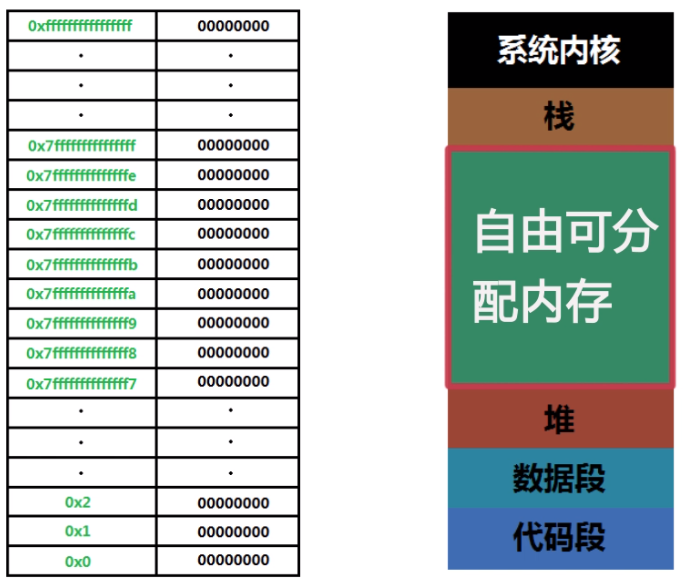

# c语言概述

c语言一开始是为了玩一款游戏从而开发的一门语言，是一门过程式的，面向过程的强语言类型，ANSI C是美国国家标准局为C语言制定的一套标准。

C语言的特点：简单，高性能，兼容性好，快速，功能强大，易于学习。

所以c语言广泛应用于做Linux嵌入式的开发，做一些命令小工具，也适合一些硬件编程，由于其高性能的特点，也适合做一些高性能的应用程序开发和系统开发。

# C语言的编译系统和源代码文件

1. C语言的源代码文件以.c结尾，其中可以输入我们的源代码。
2. 编译源代码文件需要gcc 工具，一般Linux下默认自带，可以通过`gcc -v`查看版本情况以及是否安装。
3. 编译命令：`gcc demo.c `默认生成a.out 输出文件，要想自定义输出文件名，可以通过命令：`gcc demo.c -o demo.out`实现。
4. 然后通过./a.out查看输出情况。
5. c语言程序的入口是main函数，如果一个c文件不包含main函数，他将无法被编译，从而报错。但是不同的c文件可以同时被编译，这就意味这我们可以分工协作，在不同的源文件中写入不同的可以供main主入口使用的函数，再一起编译。

# 多个源文件同时编译

1. 在头文件中使用`#include "demo.c"`来引用demo.c文件的代码到主文件中，编译时只要编译主文件即可，例如：

   编写一个main.c文件：

   ```
   #include <stdio.h>
   int main()
   {
   	int a1 = 10;
   	int a2 = 15;
   	int MaxNum = Max(a1,a2);
   	printf("最大值是：%d",MaxNum);
   	return 0;
   }
   ```

   在编写其中的Max函数，Max.c文件：

   ```
   #include <stdio.h>
   int Max(int a,int b){
   	if (a>b){
   		return a;
   	}else{
   		return b;
   	}
   }
   ```

   此时，我们如果要想产生关联，只需要在main.c的头文件中添加头文件:`#include "Max.c"`，再编译`gcc main.c`即可。

2. 将Max.c和main.c同时编译，即：`gcc Max.c main.c -o main.out`后会生成一个main.out文件，这种方法其实和第一种差不多，都是将源代码加到主文件中。

3. 前面两种方法存在着一种弊端，如果主文件的内容要修改，最后编译时，还得将两个文件重新编译一次，如果文件多了的话，所耗时间将非常多，所以我们可以将一些无需改动的文件先编译好，节省时间。所以我们可以使用`gcc -c Max.c`命令生成Max.o文件,注意这是针对那些没有main函数入口的文件进行编译操作。然后编译的时候直接放在一起编译即可：`gcc Max.o main.c`

4. 使用Makefile工具

   上面的步骤还是有点复杂，因为如果.o文件过多，每次都要手打，对程序员是一种摧残，所以我们需要使用到make工具，这个工具其实原理还是使用到gcc。具体格式如下：新建一个Makefile文件。

   ```
   main.out:Max.o main.c  //需要哪些文件
   (八个空格）gcc Max.o main.c -o main.out //编译命令
   Max.o:Max.c
   		gcc -c Max.c
   ```

   然后直接make 回车即可完成编译。

# main函数

## return 0的意义：

`&&`可以同时按顺序执行左右两个命令，而且只有当前面正确执行，返回值为0时后面的命令才会被继续执行。所以当我们main函数最后设置返回值为0时，`./main.out && ls`ls命令才会被执行，如果没有返回值或者返回值不为零，`./main.out && ls`ls命令则不会被执行。

## main函数中的参数

`main(int argv,char* argc[])`main函数中其实是存在两个参数值的，如上所示，argv表示输入的字符数，argc[]表示一个字符数组 。如下所示：

```
#include <stdio.h>

int main(int argv,char* argc[])
{
	printf("argv is %d\n",argv);
	int i;
	for(i=0;i<argv;i++){
		printf("argc[%d] is %s\n",i,argc[i]);
	}
	return 0; 
}
```

argv 有第一个默认值为0，从而对应的argc[0] =`./main.out`也就是执行语句！


# 标准输出流，输入流，和错误输出流

我们在使用`printf(),scanf()`函数时，其实是使用封装在头文件stdio.h的内容。实际代码如下：

```
printf() = fprintf(sdtout,...) 输出到终端中，输出流
scanf() = fscanf(stdin,..) 接受键盘的输入，标准输入流
fprintf(stderr) 标准错误流
```

那其实我们是可以改变输入和输出的地址的。具体如下：

```
#include <stdio.h>
/*
stdin
stdout
stderr
*/
int main()
{
//printf("")
fprintf(stdout,"information");
int a;
//scanf("%d",&a)
fscanf(stdin,"%d",&a);
if(a<0){
	fprintf(stderr,"the value must > 0");
	return 1; 错误流
}
	return 0;
}
```


```
main.out 1>>a.txt //把输出内容输出到a.txt中，1代表正常输出，可以省略。写入的内容会叠加不会覆盖。
main.out >a.txt //把写入的内容覆盖原内容
main.out <input.txt,从input.txt中获取scanf()的输入。
main.out 2>err.txt,把错误流输出到err.txt。
```

# 管道的使用

`|`可以连接 输出流和输入流的内容，可以把原来输出到终端的内容，输出到后面一个程序中，作为输入的值。

例如组合操作：

`ls /etc/ | greb ab`

或者结合多个c语言程序中，printf()和scanf() 的内容，进行组合。

# 指针

指针指的是创造一个指针变量，然后这个变量指向的是某一个变量的内存地址，而这个指针变量自身又有一个内存地址。

```
#include <stdio.h>
int main()
{
	int a =10;
	int *p = &a;(等于 int *p; p = &a)
	return 0;
}
此时 p是a的内存地址，
	*p是a的值，
	&p是指针变量p的地址，
	&*p还是a的地址
```

## 内存的概念

计算机底层其实只存在两种状态，高电流和低电流，分别代表了1，0，这就是我们的二进制，计算机是以二进制进行编制的。一般系统内存从上而下依次是



系统内存一般是操作系统所占据的，栈表示在函数调用时压栈分配空间，调用结束出栈释放空间，储配可以改动的元素，比如说数组和字符数组。代码段是保存编译后的机器码，数据段是表示存放的静态常量和变量。其中栈和堆里面的可以修改，代码段不可修改。

## gdb的使用

gdb是我们来测试我们c语言程序的地方,可以调试的程序要求我们在编译时也要注意一些：`gcc -g demo.c -o demo.out`，调试时输入：`gdb /.demo.out`。调试命令有`list`显示代码，`start`开始调试，`p`向终端输出结果等！

## 函数指针和数组指针

前面也提到了，指针是指向某一个变量的地址，而我们的数组，函数，作为存储在栈中的数据类型，也同样存在内存地址。

而数组名本身也是指向数组中第一个元素的常量指针。但值得注意的时如果直接输出这个常量名，得到的不是一个地址，而是整个数组，字符数组同理。

```
#include <stdio.h>
int main()
{
	int array[2]={100,200}；
	int *p = array //array本身就是一个地址；
	return 0；
}
	此时 array打印的值是{100，200}
	array[0] = p[0] =100
	*(array+1) = *(p+1) =200
```

字符串本身也是个数组集合，只不过他是由char定义的，因为每一个字符也只占一个字节，可以写成：char str[6] = "hello",也可以写成char str[6] ={"h","e","l","l","o","\0"}最后以null字符结尾表示结束。


