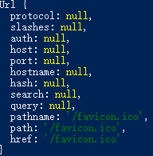

# nodejs的定义

***API:***全称Application Programming Interface，即应用程序编程接口。

API是一些预先定义函数，目的是用来提供应用程序与开发人员基于某软件或者某硬件得以访问一组例程的能力，并且无需访问源码或无需理解内部工作机制细节。

API就是操作系统给应用程序的调用接口，应用程序通过调用操作系统的 API而使操作系统去执行应用程序的命令（动作）。在 Windows 中，系统API是以函数调用的方式提供的。

**node.js简而言之就是脱离浏览器解释器编译，脱离出来的一个运行javascript代码的运行时环境**，一个运行js代码的解释器！

但是与浏览器不同的是，浏览器是无法处理后端和数据库内的数据，也不能跨文件访问的，但是node.js封装了很多模块，模块中包含了一系列API，使得我们能访问后端数据，以及访问，接受其他文件的能力！让我们获得一些服务器级别的操作！

[nodejs文档](http://nodejs.cn/)

# js模块

1. 读取文件的模块fs(file-system).

   ```
   //引入模块fs
   var fs = require('fs');
   //读取其他文件
   fs.readFile("./input.txt",function(error,data{
   	if(error){
   		console.log("文件读取失败");
   		return;
   	}
   	console.log(data.toString('utf8')) //如果没有报错，向终端以utf-8编码输出data数据，仅仅打印data,默认16进制输出。
   	error的值有两种情况Null,和Error对象，成功读取时，为Null,失败是为Error对象！
   })
   ```


2. require的作用：

   1. 读取源文件，并执行源文件的代码，比如说：

      ```
      我创建a.js文件，其中写入
      console.log("a start");
      require('./b.js');
      再创建b.js文件，写入：
      console.log("b start");
      执行a.js结果,终端显示如下：
      a start
      b start
      注意：./执行当前目录不可省略，b.js，js可省略，默认加载js
      
      ```

   2. 返回exports对象，未进行设置时，是返回空数组

      ```
      b.js写入
      var foo = 20;
      var add = function(x,y){
      	console.log(x+y);
      };
      exports.foo = foo;
      exports.Add = add; //给exports对象里添加两个属性foo，Add,并赋值
      
      a.js写入
      
      var exp = require("./b.js");
      console.log(exp.foo); //20
      exp.Add(10,20); //30
      
      node.js核心模块也是同理，输出了接口exports对象，并且在对象中定义了一系列的属性和方法（属性值为函数）。
      ```

      **注意点：各个文件中默认是分开的，node中不存在全局域，每个文件或者模块中声明的变量都只存在这个块级域中，外部不能访问！除非用接口exports**

      

   3.url模块

	  url.parse(urlString),将url地址分割为一个对象，例如：
   
   
       
   此时就可以将他作为对象进行访问其中的元素，比如说我们表单中提交的值就在query属性中，此时就可以用url.parse(req.url).query获得query。再配合querystring模块中的json格式的转对象方法`.parse`即可实现将我们的query转化为一个对象。比如说
       
   
      ```
      var qs = require("querystring")
      var str = url.parse(req.url).query
      var query = qs.parse(str)
      得到的query为：
      {user：  ，password:   }
   
      ```
   
   


​      

# 代码风格

js是一门弱语言类型，一般来说你在代码语句后面不加分号也是不影响执行的，但如果一行代码是以`()[]`或者开头，就必须在之前加上分号隔开，否则会报错  `` 是在Escma6中新增的定义字符串的方式，效果类似pre标签，支持换行！


​    

# 表单提交


# socket套接字和TCP/IP协议
tcp/ip是一种协议族，是所有协议集合的一个表现。
​Socket是对TCP/IP协议的封装，Socket本身并不是协议，而是一个调用接口（API），通过Socket，我们才能使用TCP/IP协议。

Http连接：http连接就是所谓的短连接，及客户端向服务器发送一次请求，服务器端相应后连接即会断掉。
​socket连接：socket连接就是所谓的长连接，理论上客户端和服务端一旦建立连接，则不会主动断掉；但是由于各种环境因素可能会是连接断开，比如说：服务器端或客户端主机down了，网络故障，或者两者之间长时间没有数据传输，网络防火墙可能会断开该链接已释放网络资源。所以当一个socket连接中没有数据的传输，那么为了位置连续的连接需要发送心跳消息，具体心跳消息格式是开发者自己定义的。

   socket原理：

   应用层通过传输层进行数据通信时，TCP会遇到同时为多个应用程序提供并发服务的问题，多个TCP连接多个应用程序进程可能需要通过同一个TCP协议端口传输数据，为了区别不同的应用程序进程和连接，许多计算机操作系统为应用程序与TCP/IP协议交互提供了套接字（socket）接口，应用层可以和传输层通过socket接口区分来自于不同应用进程或网络连接的通信，实现数据传输的并发服务。


建立socket一般需要一对套接字，服务端一个，客户端一个。

套接字之间的连接分为三个步骤：服务器监听、客户端请求、连接确认。

服务器监听：服务端套接字并不定位具体的客户端套接字，而是处于等待连接的状态，实时监控网络状态，等待客户端的连接请求。

客户端请求：至客户端的套接字提出连接请求，要链接的目标是服务器端的套接字，为此客户端的套接字必须首先描述他要连接的服务器的套接字，指出服务器端套接字的地址和端口号，然后向服务器端套接字提出连接请求。

连接确认：当服务器端套接字监听到或者说接收到客户端的套接字连接请求时，就响应客户端套接字的请求，建立一个新的线程，把服务器端套接字的描述发给客户端，一旦客户端确认了此描述，双方就正式链接链接，而服务器端 套接字继续处于监听状态，继续接受其他客户端套接字的连接请求。

   

**这时候客户端和服务端都会分别有一对一模一样的socket对象**，服务端对不同的客户端有不同的socket,在两边分别使用socket.write命令，就会通过这个socket接口将数据传送给对方。

## 三次握手和四次挥手

三次握手


具体流程:
 客户端发送连接请求报文 服务器端收到后回复ack报文 并为这次连接分配资源 客户端收到ack报文后也向服务器端发送ack报文 并分配资源 这些tcp连接就建立了

四次挥手


流程:
 中断连接的一端可以是客户端 也可以是服务器端 假设客户端发起中断连接的请求 意思是 我这里面没有数据发送了 但是你如果没有数据发送完成 不要先着急关闭socket 可以继续发送数据
 服务器收到消息之后 发送ack给客户端 你的请求我收到了 请等待我的后续消息
 这个时候客户端进入 fin_wait状态 继续等待服务端的fin报文 当服务端确定报文已经发送完成的时候 向客户端发送 fin报文 告诉客户端 我这边数据已经发送完了  准备好关闭连接了
 客户端收到fin报文之后 就知道可以关闭连接了 但是他不相信网络 怕服务器端不知道要关闭 所有发送ack进入time_wait状态 如果服务器端没有收到ack则重传
 服务器端收到ack后 就知道可以断开连接了
 客户端等待2mls后依然没有用收到回复 则证明服务器端已经正常关闭 那么客户端也能关闭了
 至此 tcp连接关闭

反过来要是关闭请求由另一方提出 那么过程刚好相反

问:为什么连接是三次握手 关闭的时候是四次握手
 当服务器端收到客户端的syn连接请求之后 直接发送syn+ack报文 前者用来同步 后者用来应答 但是当关闭连接的时候  服务器端收到fin报文时 很可能不会马上关闭socket  所以只能先回复一个ack报文 告诉 客户端 你的fin报文我收到了 但是只有等服务器端所有的报文都已经发送完成 才能发送fin报文 因此不能一起发送  所以需要四次握手

为什么time_wait状态 需要进行2mls才能返回close状态
 虽然按 道理四个报文发送完毕就能进入close 状态 但是我们必须承认并假象网络是不可靠的 如果最后一个ack报文丢失 那么time_wait状态就是用来重发可能丢失的ack报文


## 设计思路：（如何实现登录）

1. 用户每次进入我们就要让他设置用户名，在服务端判断如果在用户名为空的情况下，客户端输入的数据都视为初始化的用户名，不为空则是聊天命令的内容，未实现的功能如留言，重命名，重新登陆也可以考虑围绕用户名来做！还有end方法会将两端都关闭！
2. 另一种是在客户端设置一个标志flag,当flag == true时，就执行登录协议，然后将flag改为false，后续就是正常聊天输入了。
3. 还有一种是使用同步输入，安装readlineSync模块,这种可以阻隔后续的代码，实现同步。

## 为何同一个客户端代码能让不同的客户端同时使用

原理：这就要归功于我们的事件和监听器，回调函数了，当有客户端创建连接时，便会触发一个回调，不同的客户端创建，就会触发互不相干的回调，里面的变量或者函数等等，其他回调函数是访问不到的，但是，如果一个变量放在了回调之外，那所有的客户端即回调就都能访问到了！

## 当一个全局变量作为参数传到函数里

```
var username;
   function deal(username){
    username = 'jack';
   }
   deal(username);
   console.log(username);
```

如上的结果，username依然是undefined,是因为，作为参数传递时，username只是将值传进去了，而函数里的username只是一个形参，一个表示，这时候的真实情况应该是undefiend = 'jack',自然改不掉变量undefined的值，这时候需要改的话，就不应该传username作为参数进去，如：

```
 var username;
   function deal(){
    username = 'jack';
   }
   deal();
   console.log(username);
```

此时就是username的值就是jack了

# nodejs异步和同步处理

nodejs中的事件通过回调函数，都是异步处理的，这样可以节省很多时间，但有时候，我们需要某个事件执行完后，再执行下一个，也就是需要同步的效果，这时候，有些eventEmitter实例可以提供同步处理。

比如说readline-sync模块，readline模块和process.stdin的最大区别是，readline是获取用户输入一行的内容就结束，而process.stdin会一直获取用户输入的内容，不会停下。比如说：

```
const readline = require('readline');

const rl = readline.createInterface({
  input: process.stdin,
  output: process.stdout
});

rl.question('你如何看待 Node.js 中文网？', (answer) => {
  // TODO：将答案记录在数据库中。
  console.log(`感谢您的宝贵意见：${answer}`);
  rl.close();
});
process.stdin.setEncoding('utf8');
process.stdin.on('readable', function () {
    let chunk;
    while ((chunk = process.stdin.read()) !== null) {
        console.log(chunk);
    }
});
readline只会记录一次，但是两次输入是异步的，都会被捕捉到，但是如果是异步的readline-sync就正常了。
```

待解决乱码问题......

Object.keys(obj) 此函数可以返回，以数组形式给出的对象里所有的键。


