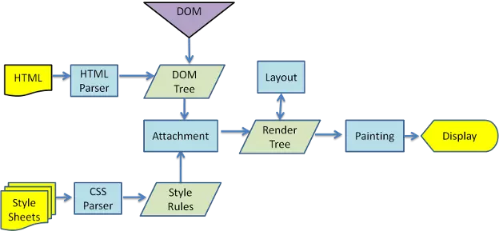

# React安装

## npm安装

### 全局安装 

全局安装的命令是 `npm install xxx -g/--global`全局安装，会将安装的模块放在node安装目录下的node_modules文件夹中，可使用`npm root -g`获得此安装目录。

作用：全局安装后可以供命令行(command line)使用，用户可以在命令行中直接运行该组件包支持的命令。

###  本地安装

本地安装方式是键入命令：npm install webpack 或 npm install webpack --save-dev（推荐）等，其中参数--save-dev的含义是代表把你的安装包信息写入package.json文件的devDependencies字段中，包安装在指定项目的node_modules文件夹下。

package.json的作用：里面记录了当前项目所需要的依赖，有了这个文件，即便将node_modules删除，只要在当前目录下执行 npm install ，他就会自动生成node_modules，下载package.json里所需要的依赖，并生成package.lock.json, 这个文件是 node_modules 文件夹或者 package.json 文件发生变化时自动生成的。这个文件主要功能是确定当前安装的包的依赖，以便后续重新安装的时候生成相同的依赖，而忽略项目开发过程中有些依赖已经发生的更新。

所以不管是全局安装还是本地安装，都是将模块放在node_modules文件夹下，全局安装的组件，可以在命令行直接运行该组件支持的一些命令。

那为什么全局安装了还需要本地安装呢？[原因](https://blog.csdn.net/chushoufengli/article/details/88995840)

## 安装命令

```
npm install create-react-app -g   // 全局安装create-react-app
npx create-react-app react-example 
cd react-example
npm start
```

创建一个新的应用后，默认是从src文件中读取index.js文件,进行渲染。创建一个自己的新的项目就需要把其中自动生成的预览页面给全部删掉，从头开始创建index.js文件来开始项目。

# React的作用和意义

1.按需渲染，增强前端页面的性能，搞清这一点，我们得弄懂浏览器渲染页面的过程：

浏览器渲染引擎工作流程都差不多，大致分为5步，**创建DOM树——创建StyleRules——创建Render树——布局Layout——绘制Painting**

​    第一步，用HTML分析器，分析HTML元素，**构建一颗DOM树**(标记化和树构建)。

​    第二步，用CSS分析器，分析CSS文件和元素上的inline样式，生成页面的样式表。

​    第三步，将DOM树和样式表，关联起来，构建一颗Render树(这一过程又称为Attachment)。每个DOM节点都有**attach方法，接受样式信息**，返回一个render对象(又名renderer)。这些render对象最终会被构建成一颗Render树。

​    第四步，有了Render树，浏览器开始布局，为每个Render树上的节点确定一个在显示屏上出现的精确坐标。

​    第五步，Render树和节点显示坐标都有了，就调用每个节点**paint方法，把它们绘制**出来。

用我们传统的开发模式，原生JS或JQ操作DOM时，浏览器会从构建DOM树开始从头到尾执行一遍流程。这就会造成性能的极大浪费，所以react引入虚拟dom的概念，用js去模拟dom树，在js层面进行对比，按需渲染页面。



2.组件化开发，当一个html元素我们需要重复调用时，用原生代码进行操作，重复写显然麻烦，所以react为我们提供了一些组件化开发的放式，将一个个html元素做成一个标签样式的组件，作为一个模板，它可以用js原生的构造函数创建或者class类创造。达成重复利用的效果。

# react基本语法

[参考官方文档](https://react.docschina.org/docs/getting-started.html)

一点项目心得：

1. 关于a标签，a标签不设置href属性的话，是没有变色和自动跳转更新页面的功能的

2. 关于变量命名格式，函数的参数也是一种变量，命名需要注意格式user.id是不行的

   变量命名规则：

   - 名称可包含字母、数字、下划线和美元符号
   - 名称必须以字母开头
   - 名称也可以 $ 和 _ 开头（但是在本教程中我们不会这么做）
   - 名称对大小写敏感（y 和 Y 是不同的变量）
   - 保留字（比如 JavaScript 的关键词）无法用作变量名称

3. react中的外来数据props，和私有state改变时，组件会自动进行重新渲染的（由setState()重新render()），由于state和props是一种对象，所以里面的值可以是任何数据比如说用数组[{},{},{},]包含的多个对象，一个函数，这里函数有一些特殊的用处，子组件可以通过props接受父组件中定义的函数，然后再子组件中调用父组件中的函数，将子组件的一些变量和数据作为参数传到父组件中进行处理，这其实就是一种回调函数的方法。state一般用来处理子组件传来的一些数据，因为在class中 除了函数内，是不能声明其他变量的，

4. 熟练掌握解构赋值，注意区分解构赋值和重新赋值，比如说：

   ```
   {user:10,name:20} = {user:1,name:2}  //错误操作，左边不是一个变量，而是一个对象，是重新赋值不了的，必须将左边的值赋给一个变量，这时候变量指向这个对象本身，重新赋值其实是一个覆盖操作。
   {user,name} = {user:1,name:2} //正确解构赋值操作，将值付给了两个变量user,name。
   顺便一提，当对象中的键和值的变量名称一致时，可以简写成一个，
   var name = shf;
   var age = 18;
   console.log({name,age}) 
   ```

## state状态和setState函数

    state是class的私有变量，称为该类的一个状态，可以通过this.setState()函数传入一个对象改变state变量也就是状态，同时setState函数会同时渲染更新改变的部分也就是状态。

   **首先setState是异步更新的**，所以我们有两种方式实现同步的一个方法：

   1. 在setState完成的回调里执行需要的操作
   
      setState函数的第二个参数允许传入回调函数，在状态更新完毕后进行调用，这种情况适用于更新state后需要获取更新后的数据时，譬如：
   
      ```react
      this.setState({
      
            load: !this.state.load,
      
            count: this.state.count + 1
      
          }, () => {
      
                console.log(this.state.count);
      
                console.log('加载完成')
      
          });
      ```
   
   2. 传入状态计算函数
   
      除了使用回调韩式的方式监听状态更新结果之外，react还允许我们传入某个状态计算函数而不是对象作为第一个参数。状态计算函数能够为我们提供可依赖的组件的state与props值，会在上一个setState函数执行后获取上次修改的值基础上进行修改，因为react为了性能要求，当多个setState函数同时调用时，会把他们进行合并，同时如果对同一属性赋值，只会按顺序取最后一个setState合并，只进行这一次修改赋值操作。所以这种情况适用于，多个setState同时调用，并且需要获取上一次修改的state的值再对state进行修改时！
   
      ```react
      this.setState(function(prevState, props){
      
                 return {需要改变的state的名称: 改变之后的state的值}
      
      });
      ```

## 详情请看react组件生命周期：


## 异步和同步的理解

**异步是非阻塞的，也就是他不会阻塞后面代码的执行，但是也会等待前面的同步代码执行完毕后，再执行异步代码命令！**

## 生命周期钩子与state状态的使用

state作为react中一个组件私有的状态或者说变量，通过setState函数可以实现重新render更新页面，但是state可不能滥用！


在设置state的时候我们需要问自己三个问题：

1. 该数据是否是由父组件通过 props 传递而来的？如果是，那它应该不是 state。
2. 该数据是否随时间的推移而保持不变？如果是，那它应该也不是 state。
3. 你能否根据其他 state 或 props 计算出该数据的值？如果是，那它也不是 state。


而由于这个特性，我们也要尽量减少重新render的次数，提高性能，比如说，**将一些Ajax请求放在class构造外面，或者放在constructor构造函数中，一次性赋值，然后render**。而不能反复调用setState更新页面，浪费性能！但要注意的是，在class外部定义的函数是无法调用内部class里的this.state和props的，而class内部可以调用外部的！

```
React生命周期函数：

    组件加载之前，组件加载完成，以及组件更新数据，组件销毁。

    触发的一系列的方法 ，这就是组件的生命周期函数


组件加载的时候触发的函数： 

    constructor 、componentWillMount、 render 、componentDidMount

组件数据更新的时候触发的生命周期函数：

    shouldComponentUpdate、componentWillUpdate、render、componentDidUpdate


你在父组件里面改变props传值的时候触发的：

    componentWillReceiveProps


组件销毁的时候触发的：

    componentWillUnmount


必须记住的生命周期函数：


    *加载的时候：componentWillMount、 render 、componentDidMount（dom操作）

    更新的时候：componentWillUpdate、render、componentDidUpdate

    *销毁的时候： componentWillUnmount
```

## 组合组件和继承