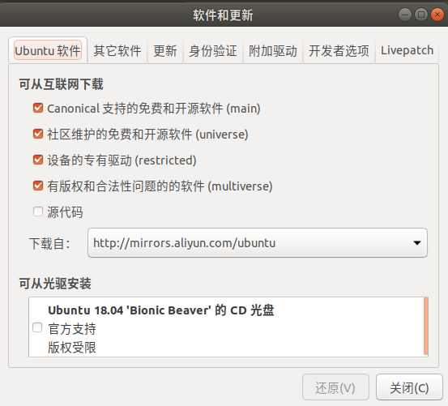
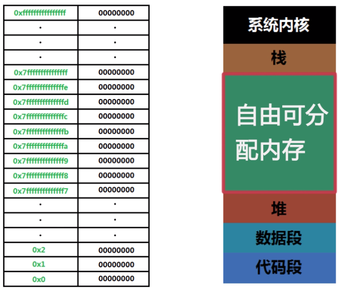

# var let const 声明变量的区别

var 可以声明全局变量，也可以声明局部变量，即在函数内的变量，但是它不能声明块级变量即在{}中定义的变量，而let可以。

```javascript
var i = 7
for(var i = 0;i<10;i++){}
//此时i的值为10

var i=7
for(let i = 0;i<10;i++){}
//此时i的值为7

```

而在循环中，let声明的循环变量也只在当前循环有效，比如说：

```javascript
var a = [];
for (var i = 0; i < 10; i++) {
  a[i] = function () {
    console.log(i);
  };
}
a[6](); // 10
```

```javascript
var a = [];
for (let i = 0; i < 10; i++) {
  a[i] = function () {
    console.log(i);
  };
}
a[6](); // 6
```

在某些情况下，可以代替函数的闭包。

提升：使用var可以提升你的声明变量，而let,const则不会提升,还有不写任何的话也不会提升，而且注意：**JavaScript 初始化不会被提升***

***JavaScript 只提升声明，而非初始化***

```javascript
console.log(x); //undefined
var x = 7
```


而const定义的是一个常量，通常他的值不能被改变，修改会报错，比如说：

```javascript
const i = 10;
i = 7 报错
```

而const定义的数组和对象可以通过数组和对象的方法改变

```javascript
const obj = {
age : 18,
address: '中国'
}
obj.age = 19
obj.address ='美国'
//可以改变

const array = []
array[0] = 1
array.push(2)  //可以改变

//但是重新赋值则会报错比如：
array = [1,2,3] 报错
obj = {
age:20,
address:'英国'
} //报错！
```

# 字符串数组的问题

在js中无法通过数组方式改变字符串，只能获取某个对应索引的字符！比如说：

```javascript
var str = "abcdefg"
    console.log(str[2]);
    str[2] = "b";
    console.log(str[2]); //c是没有变化的！
```


# 正则表达式

1. 正则表达式的写法

   正则表达式的写法为/pattern/attributes例如：`str.match(/m/g)`虽然正则适用于搜索或者改字符串的内容，但是，里面要搜索的内容是不用加引号的。

   如果要搜索某个区间内的任意字符，我们需要用方括号或者括号来实现：

   ```
   /[abc]/只要包括集合内的任意字符
   /abc/必须abc都包含
   [0-9]0到9内的任意数字
   [a-z]a-z的任意小写字母
   [A-Z]A-Z的任意大写字母
   [A-z]任意字母，不区分大小写
   符号^表示取反
   [^abc]表示任意除了abc的其他内容
   (red|blue)或，表示red或者blue的内容
   ```

   元字符：

   ```
   .	查找单个字符，除了换行和行结束符。
   \w	查找单词字符。
   \W	查找非单词字符。
   \d	查找数字。
   \D	查找非数字字符。
   \s	查找空白字符。
   \S	查找非空白字符。
   \b	匹配单词边界。
   \B	匹配非单词边界。
   \0	查找 NUL 字符。
   \n	查找换行符。
   \f	查找换页符。
   \r	查找回车符。
   \t	查找制表符。
   \v	查找垂直制表符。
   \xxx	查找以八进制数 xxx 规定的字符。
   \xdd	查找以十六进制数 dd 规定的字符。
   \uxxxx	查找以十六进制数 xxxx 规定的 Unicode 字符
   查找所有中文字符
   /[\u4e00-\u9fa5]/g  //我们需要一个集合来规定所有任意中文字符内容
   ```

   修饰符：写在//之外

   ```
   i 不区分大小写的匹配
   g 进行全局匹配（因为默认匹配到第一个符合的就停止）
   m 进行多行匹配
   ```

   量词（包含几个指定内容）：

   ```
   n+	匹配任何包含至少一个 n 的字符串。
   n*	匹配任何包含零个或多个 n 的字符串。
   n?	匹配任何包含零个或一个 n 的字符串。
   n{X}	匹配包含 X 个 n 的序列的字符串。
   n{X,Y}	匹配包含 X 至 Y 个 n 的序列的字符串。
   n{X,}	匹配包含至少 X 个 n 的序列的字符串。
   n$	匹配任何结尾为 n 的字符串。
   ^n	匹配任何开头为 n 的字符串。
   ?=n	匹配任何其后紧接指定字符串 n 的字符串。
   ?!n	匹配任何其后没有紧接指定字符串 n 的字符串
   ```

   ```
   量词注意点：
   /lo*/g这个表达的意思不是任何包含零个或者多个lo的字符串，而是将l全局匹配，l后包含0个或者多个o的内容, *只匹配前面的第一个字母或者元字符
   
   ```

2. 正则表达式的属性

   ```
   global  是否设置全局匹配g 返回值： true false
   ignoreCase 是否设置忽略大小写i 返回值： true false
   lastIndex 返回有exec或者test方法的每次下次匹配的起始位置，使用该方法的正则必须具备全局匹配g 
   返回值：下次开始匹配位置的索引（匹配元素最后一个索引的下一个）
   multiline 是否设置多行匹配 返回值： true false
   source 返回不包括任何正则格式的匹配源文本
   ```

3. 正则表达式或连接使用`|`,常见于手机号的正则中：

   ```
   ^1(3\d|4[579]|5[^4]|66|7[0135678]|8\d|9[89])\d{8}$ //括号里面的内容就是用|连接的或内容
   ```

   

4. 正则表达式的方法

   ```
   exec 这个方法类似于string方法中match但是两者有所不同
   1.格式： var str = 'hello, lolitaloooo'
        var patt = /lo*/g
           console.log(patt.exec(str));
           console.log(str.match(patt));
   2.输出内容：
   		console.log(patt.exec(str));
           console.log(patt.exec(str));
           console.log(patt.exec(str));
           console.log(patt.exec(str));
           console.log(patt.exec(str));
           console.log(patt.exec(str));
           console.log(patt.exec(str));
           console.log(patt.exec(str));
           console.log(str.match(patt));
           
           ["l", index: 2, input: "hello, lolitaloooo", groups: undefined]
           ["lo", index: 3, input: "hello, lolitaloooo", groups: undefined]
           ["lo", index: 7, input: "hello, lolitaloooo", groups: undefined]
           ["l", index: 9, input: "hello, lolitaloooo", groups: undefined]
           ["loooo", index: 13, input: "hello, lolitaloooo", groups: undefined]
           null
           ["l", index: 2, input: "hello, lolitaloooo", groups: undefined]
           ["lo", index: 3, input: "hello, lolitaloooo", groups: undefined]
           (5) ["l", "lo", "lo", "l", "loooo"]
   		
       从上面的输出结果可以知道，在面对全局匹配的RegExp时，exec每次输出只会返回一组匹配值，第一次是第一个，第二次通过lastIndex属性的匹配位置开始搜索下一个，依次类推直到搜完，下一次再也搜不到匹配项时，它会将lastIndex修改为0,返回null,下一次匹配将重新开始，而且可以看到在全局匹配中，返回的值，exec包含匹配值，首字符的索引，被检索的字符串，而match方法只包含所有匹配值的数组。
       但是如果后面没有g,即不是全局匹配，两者返回的值一摸一样：
           var str = 'helo'
           var patt = /lo*/
           console.log(patt.exec(str));
           console.log(patt.exec(str));
           console.log(patt.exec(str));
           console.log(patt.exec(str));
           console.log(patt.exec(str));
           console.log(patt.exec(str));
           console.log(patt.exec(str));
           console.log(patt.exec(str));
           console.log(str.match(patt));
           返回值：
           ["lo", index: 2, input: "helo", groups: undefined]
           ["lo", index: 2, input: "helo", groups: undefined]
           ["lo", index: 2, input: "helo", groups: undefined]
           ["lo", index: 2, input: "helo", groups: undefined]
           ["lo", index: 2, input: "helo", groups: undefined]
           ["lo", index: 2, input: "helo", groups: undefined]
           ["lo", index: 2, input: "helo", groups: undefined]
           ["lo", index: 2, input: "helo", groups: undefined]
           ["lo", index: 2, input: "helo", groups: undefined]
        可以发现，两者返回的值是一模一样的，此时，match方法返回的值和全局匹配就不一样了。
   ```

   ```
   如果要用同样的正则全局检索不同的字符串，就需要把上次检索后的lastIndex重置为0，否则会从上个字符串的lastIndex开始，因为lastIndex属性是属于正则的，同样会带到不同的被检索字符串中
           var str = 'hello world'
           var patt = /lo*/g
           console.log(patt.exec(str));
           console.log(patt.lastIndex);
           var str2 = 'logggggloo'
           console.log(patt.exec(str2));
           结果：
           ["l", index: 2, input: "hello world", groups: undefined]
           3
           ["loo", index: 7, input: "logggggloo", groups: undefined] //检索的是从索引3开始
   ```

   

   **如何同时操作多行元素，用alt键选中你要操作的内容，此时alt不松手，按任意键，会出现多选光标，再进行操作即可。***

   

   ```
   test方法也是一样，用于判断字符串中是否有匹配内容，返回值为true或者false，和exec方法一样，test方法每次也是返回一组比较结果，lastIndex随之而改变。
           var str = 'hello world'
           var patt = /lo*/g
           console.log(patt.test(str));
           console.log(patt.lastIndex);
           console.log(patt.test(str));
           console.log(patt.lastIndex);
           console.log(patt.test(str));
           console.log(patt.lastIndex);
           console.log(patt.test(str));
           console.log(patt.lastIndex);
           结果：
           true
           3
           true
           5
           true
           10
           false
           0
   ```

   ```
   compile方法用于改变正则表达式的内容，比如说：
           var str = 'hello world'
           var patt = /lo*/g
           console.log(patt.exec(str));
           console.log(patt.lastIndex);
           patt.compile(/e/g)
           console.log(patt.lastIndex);
           console.log(patt.exec(str));
           结果：
           ["l", index: 2, input: "hello world", groups: undefined]
           3
           0
           ["e", index: 1, input: "hello world", groups: undefined]
           这里要注意patt一旦改变，lastIndex也随之重置。
   ```

5. 适用的字符串方法

   1. str.search(RegExp),返回值为第一个字符的索引。search() 方法不执行全局匹配，它将忽略标志 g。它同时忽略 regexp 的 lastIndex 属性，并且总是从字符串的开始进行检索，这意味着它总是返回 stringObject 的第一个匹配的位置。当搜索不到任何匹配内容时，则返回-1。

   2. str.match(RegExp)返回值为符合条件的匹配内容，以数组的形式返回，可以进行全局搜索。但是要注意全局搜索下的数组没有非全局搜索时的那么详细，仅仅是匹配值的集合，要想获得详细内容，可利用RegExp.exec(str)来反复获得。

   3. replace方法可以用来实现值的替换操作，str.replace(RegExp,'引号包含的字符串' )，这个支持全局匹配

      单一字符或者不加全局匹配的正则，只匹配和替换找到的第一个。

      ```
              var str = 'hello werld'
              console.log(str.replace('e','w'));
              console.log(str.replace(/e/,'w'));
              console.log(str.replace(/e/g,'w'));
              结果：
              hwllo werld
              hwllo werld
              hwllo wwrld
      ```

      

   4. split方法可以将字符串分割成数组，他接受两个参数，第一个可以是正则表达式，也可以是其他字符，意思是将这个匹配内容变成逗号来分割数组，但要注意的是，这个固定执行的是全局匹配，无论是单一字符还是不加全局匹配的正则，执行的都是全局匹配和替换。

      ```
              var str = 'hello werld'
              var array = str.split('e')
              console.log(array);
              var array1 = str.split(/lo*/)
              console.log(array1);
              结果：
              (3) ["h", "llo w", "rld"]
              (4) ["he", "", " wer", "d"]
      ```

# float小结

float的效果是将无论块级元素还是行级元素进行水平左对齐或者右对齐，清除浮动有三种方法：

1. 给浮动元素的父级元素添加overflow = hidden

   这种方法实际上形成一个BFC空间，主要应用于撑开父级元素的高度，例如：

   ```html
   <!DOCTYPE html>
   <html lang="en">
   <head>
       <meta charset="UTF-8">
       <title>Document</title>
       <style>
           .big{
               width: 500px;
               background-color: pink;
               overflow: hidden;
           }
           .box1{
               height: 100px;
               width: 100px;
               background-color: green;
               float: left;
           }
       </style>
   </head>
   <body>
       <div class="big">
           <div class="box1"></div>
       </div>
   </body>
   </html>
   <!--此时父级元素没有设置高度，所以清楚浮动后的高度就被box1撑满了。-->
   ```

2.  给同级浮动元素的后面元素，必须为块级元素，设置clear属性

3. ```
   父级元素::after{
   	content:'';
   	display:block/table;
   	clear:both
   }
   ```

   其实方法2和3的原理是一样的，但是浮动只是让被清除浮动的那个元素了解了前面有这样一个浮动元素的在基本流的高度，此时它会为前面保留，不会挤进去那个空间，后面的元素自然会跟在被清除浮动元素的后面，而被清除浮动元素之前的元素，则不会有这个概念，他们没有clear属性，也就无法知晓，自然会挤进去。

   而overflow=hidden则是给父级元素清除了浮动效果，自然只有父级元素知晓了此时浮动元素在基本流对应的空间，此时父级元素如果如果没设置高度，则会被撑开，而其内的自己元素不知晓，自然还是会挤上去。

   ```html
   <!DOCTYPE html>
   <html lang="en">
   <head>
       <meta charset="UTF-8">
       <title>Document</title>
       <style>
           .big{
               width: 500px;
               background-color: pink;
               overflow: hidden;
           }
           .box1{
               height: 100px;
               width: 100px;
               background-color: green;
               float: left;
             
           }
           .box2{
               height: 200px;
               width: 200px;
               background-color: black;
               float: left;
           }
           .box3{
               height: 50px;
               width: 50px;
               background-color: red;
               clear: both;
           }
           .box4{
               height: 50px;
               width: 50px;
               background-color: blue;
           }
       </style>
   </head>
   <body>
       <div class="big">
           <div class="box1"></div>
           <div class="box2"></div>
           <div class="box3"></div>
           <div class="box4"></div>
       </div>
   </body>
   </html>
   ```

4. 利用floats实现文本环绕，要理解一个概念，行框空间（对于文字来说所形成的空间），浮动会清除浮动元素的块空间，而不会清楚行框空间，所以文字会环绕在图片或者浮动元素周围。

# 运算符小结

1. 位运算


# Linux Ubuntu 安装，报错小结

1. 下载软件

   下载软件一般使用命令 `sudo apt-get install 软件名称 `其中`sudo``的意思是获取最高权限。但有时候一些外部的软件需要搭载网址等等，按照教程操作即可。

2. 卸载软件

   命令：`sudo apt-get remove 软件名称`

3. 设置国内源

   在软件与更新里一般要设置国内源以提高我们的下载速度，否则，初始源的速度会很慢，一般推荐使用阿里源。

   

4. 常用终端命令查询：<a href='https://blog.csdn.net/seniusen/article/details/81055642'>常用终端命令查询</a>

5. git 命令其实和终端，windows下的cmd是一样的。

6. 利用githubpage和jekyll搭建个人博客，这里仅仅介绍如何如何利用模板快速搭建自己的博客。

   1. 下载模板文件到本地，确认本地文件中有gem.file文件存在。

   2. 由于这是别人的模板文件，我们需要利用bundler。

      命令：`sudo gem install bundler`利用gem下载bundler。

      `cd 模板目录`并且`bundle install`配置bundle。

      `bundle exec jekyll server`本地服务器查看模板效果，这时候我们就可以放心的推到GitHub上不用担心出现404了。

   3. 利用终端打开模板目录，`git init`初始化，`git remote add`添加远程仓库。这里要注意你需要注册号github账号，并建立ssh公钥，和本地之间。

   4. 利用`git add .和git commit -m "描述"`将内容添加到本地仓库，然后利用git push推到github远程仓库。

   5. 设置githubpage,首先要注意你的远程仓库名字的命名格式是有要求的，必须为：username.github.com，githubpage才会为你 自动生成username.github.io的域名。在远程仓库设置选项的githubpage可以设置。基本git操作请点击：<a href="https://git-scm.com/book/en/v2">git教程</a>

7. 报错问题，使用gem下载jekyll出现如下报错：

   

​        情况一：ruby安装时没有安装ruby-dev,手动安装一次即可`sudo apt-get install ruby-dev`

​		情况二：以上方法无法解决的话 `sudo apt-get install libxml2-dev libxslt-dev`

# c语言小结：指针和内存

## 内存分类

位："位(bit)"是电子计算机中最小的数据单位。每一位的状态只能是0或1。

字节：8个二进制位构成1个"字节(Byte)"，它是存储空间的基本计量单位。1个字节可以储存1个英文字母或者半个汉字，换句话说，1个汉字占据2个字节的存储空间。

字："字"由若干个字节构成，字的位数叫做字长，不同档次的机器有不同的字长。例如一台8位机，它的1个字就等于1个字节，字长为8位。如果是一台16位机，那么，它的1个字就由2个字节构成，字长为16位。字是计算机进行数据处理和运算的单位。

计算机底层其实只存在两种状态，高电流和低电流，分别代表了1，0，这就是我们的二进制，计算机是以二进制进行编制的。一般系统内存从上而下依次是



系统内存一般是操作系统所占据的，栈表示在函数调用时压栈分配空间，调用结束出栈释放空间，储配可以改动的元素，比如说数组和字符数组。代码段是保存编译后的机器码，数据段是表示存放的静态常量和变量。其中栈和堆里面的可以修改，代码段不可修改。

# 指针数组和数组指针

# 闭包

闭包函数其实就是一种嵌套在函数里的函数，这个内部函数可以访问外部函数中声明的变量，接受的参数，甚至是其他内部函数。其实就像我们把这个外部函数当成全局了一样，其内部函数的规则跟普通函数对全局的规则是一样的，比如我们可以定义一个计数器：

```
 var add = (function demo(){
            var counter = 0;
            return function count(){
                counter += 1;
                return counter;
            }
        })();
        add();
        add();
        console.log(add());
        注意：1.我们需要将内部函数作为返回值返回给一个变量add,供我们调用，否则直接调用count是不行的，因为count作为在函数demo声明的函数，其实也是局部的，全局并不能访问，这样我们就实现了count变量只存在于函数demo中，实现了变量私有化。
```

闭包其实还是有很多用处，比如说在我们的轮播图中，利用循环使用闭包实现变量私有化就很有必要！

普通赋予：

```
	
    
    
    <script>
    var imgs = document.getElementsByTagName('img');
    console.log(imgs);
    for(i=0;i<2;i++){
        imgs[i].onclick = function(){
            console.log(666);
            console.log(imgs[i]);
        }
    }
    此时，我们利用循环分别给图片1和2赋予了点击事件，本来我们想要的效果是点击某个图片，显示当前图片的信息，但结果是，函数里的imgs[i] = imgs[3]，也就是循环结束后i的值，因为函数只是被定义，并没有被调用，当调用也就点击时，循环早已结束，i的值也变成了3。
    此时我们需要让i这个变量私有化，所以我们想到了闭包：
    
    
    
    <script>
    var imgs = document.getElementsByTagName('img');
    //imgs[0].style.opacity = 0;
    console.log(imgs);
    for(i=0;i<3;i++){
        (function(i){
           imgs[i].onclick = function(){
            console.log(666);
            console.log(imgs[i]);
        }  
        })(i)
    }
    此时，我们用了一个自执行函数，每次循环都将外部的参数i传到我们的外部函数里，这样，在赋予每个图片事件的同时，也使得我们我们的内部函数每次点击执行时，只能访问到外部函数的中的变量，实现了变量私有化！
    而在es6中，let变量由于其作用域是{}里的内容，也能使得，每次循环时的变量只能在本次循环有效，这就实现了和闭包一样的效果，将变量私有化，所以建议在循环时将循环变量用let声明会比较好，它也适用于事件函数中。
```

# css - padding的妙用

padding内边距不会占据正文的内容，但是可以占据背景颜色和背景图片，通过这个，我们可以实现很多效果，比如：可以设置背景图片作为图标，通过位移让他显示在内边距中，从而和正文的内容分开，不用在单独设一个盒子来装图标。内边距不会挤占父元素的背景位置，而外边距则会挤占父元素的背景位置。

# 内联元素和块级元素的异同点：

## 异：

1. 内联元素可以同行排放，但是无法设置宽高
2. 块级元素不能同行排放，但能设置宽高
3. 设置水平和垂直居中：内联元素在父级元素加行高line-height，以及设置text-align即可，块级元素水平居中设置margin:0 auto,垂直居中：display=table-cell,vertical-align = middle,因为vertical-align是单元格特有的属性。

## 同

1. 两者都可浮动和定位，也都拥有着margin和padding。
2. 


# js特效

## 展开图

有时后我们需要一种展开效果时，会遇到一种问题，我们怎么控制他的展开方向呢，这其实和你定位时使用的是left还是right ,还是top,bottom有关，left会从左展开，top会从上展开依次类推，这其实很好理解，图片展开时，他需要保持你定位时与被定为对象的距离，所以展开方向会有所不同，例子：

```html
<!DOCTYPE html>
<html lang="zh">
<head>
	<meta charset="UTF-8">
	<meta name="viewport" content="width=device-width, initial-scale=1.0">
	<meta http-equiv="X-UA-Compatible" content="ie=edge">
	<title></title>
	<style>
		.big-box{
			width: 100px;
			height: 100px;
			background-color: pink;
			margin: 0 auto;
			position: relative;
		}
		.small-box1{
			width: 100px;
			height: 100px;
			background-color: red;
		}
		.small-box2{
			width: 0px;
			overflow: hidden;
			height: 0px;
			background-color: blue;
			position: absolute;
			top:100px;
			right:0px;
		}
	</style>
</head>
<body>
		<div class="big-box">
			<div class="small-box1"></div>
			<div class="small-box2">你好</div>
		</div>
		<script type="text/javascript">
			var big = document.getElementsByClassName("small-box1")[0];
			var small1 = document.getElementsByClassName("small-box2")[0];
			small1.style.transition = "all 1s"
			big.onclick = function(){
				var hei = small1.offsetHeight;
				var wid = small1.offsetWidth;
				if(hei == 0 && wid == 0){
					small1.style.height = '100px';
					small1.style.width = '100px';
				}else{
					small1.style.height = 0;
					small1.style.width = 0;
				}
			}
		</script>
</body>
</html>
```

上例中随着定位的不同，展开方式也不一样！（多思考）


# es6中函数参数的默认值

在es6中可以为我们的形参设置默认值，以防当用户没有给定参数时的默认情况，比如说：

```javascript
function cal(x=1,y=2){
    console.log(x+y);
}
cal(5)  //7
cal()   //3
```

而且有一点要注意的是函数默认值，如果是以表达式给定的默认值，它是惰性求值的，即只有在调用的时候才会求值（[关于惰性求值和及早求值]([https://baike.baidu.com/item/%E6%83%B0%E6%80%A7%E6%B1%82%E5%80%BC/22814179?fr=aladdin](https://baike.baidu.com/item/惰性求值/22814179?fr=aladdin))），比如说：

```javascript
val x = 10
function demo(x = y+1){
    console.log(x);
}
demo(); //11
x = 20
demo(); //21
```

而且我们也可以通过解构赋值的方式，给函数参数设置默认值：

```javascript
// 写法一
function m1({x = 0, y = 0} = {}) {
  return [x, y];
}

// 写法二
function m2({x, y} = { x: 0, y: 0 }) {
  return [x, y];
}
```

注意，在解构时生成的变量{x,y}如果没有对象去赋值，变量x,y则是非法的，也就是说以下会报错：

```javascript
function foo({x, y = 5}) {
  console.log(x, y);
}
foo(); //TypeError: Cannot read property 'x' of undefined
```

所以在上一个写法一和写法二中的区别就是，两者都为函数参数设置了一个默认值，注意此时函数的默认值是一个解构赋值对象，不是两个变量x,y。而写法一函数参数的默认值是空对象，但是设置了对象解构赋值的默认值；写法二函数参数的默认值是一个有具体属性的对象，但是没有设置对象解构赋值的默认值。当用户没有写任何参数时，则会触发函数参数的默认值，对象解构则被赋值。此时：x,y变量都会被声明，注意此时x,y的作用域由前面的声明关键字决定（var,let,const）**在函数中，实际执行的是let x,y**,x和y都为0，而一旦用户给定实参，函数参数默认值则不会触发，此时对象结构的赋值由实参对象决定。**所以要分清楚，函数参数的默认值和解构对象的默认值是两个概念，不要搞混！**

```javascript
// 函数没有参数的情况
m1() // [0, 0]
m2() // [0, 0]

// x 和 y 都有值的情况
m1({x: 3, y: 8}) // [3, 8]
m2({x: 3, y: 8}) // [3, 8]

// x 有值，y 无值的情况
m1({x: 3}) // [3, 0]
m2({x: 3}) // [3, undefined]

// x 和 y 都无值的情况
m1({}) // [0, 0];
m2({}) // [undefined, undefined]

m1({z: 3}) // [0, 0]
m2({z: 3}) // [undefined, undefined]
```

# 原型和原型链

懒得写：[原型和原型链](https://www.jianshu.com/p/ddaa5179cda6)

# 类和对象

类其实就是抽象的对象，而我们平时所称的对象其实是实例对象，也叫做具体对象，我们将很多不同对象的共有属性和方法提取出来就叫做类，比如说不同的猫，不同的狗都是狗，虽然毛发和长相不相同，但是叫声相似，都是狗，有着共有属性，将这些提取出来就叫做类。

## es6声明类的方法

```javascript
class Star{
    constructor(name,age){
        this.name = name;
        this.age = age;
    }
    sing(){
        console.log("I can sing!")
    }
}

var ldh = new Star("刘德华",18);
ldh.sing();
console.log(ldh);
```

**注意点:**1. class声明类的时候所有函数之间不需要用逗号分隔。也不能

			2. class构建的类里所有函数不需要用function声明，直接写就行。

## 继承关键字：extends,super

继承主要用于多个类之间的继承，使用extends关键字可以使得子类继承父类里的属性和方法，比如说：

```javascript
class Father{
    constructor(x,y){
        this.x = x;
        this.y = y;
    }
    sum(){
        console.log(this.x+this.y);
        console.log(100);
    }
}
class Son extends Father{
    constructor(x,y){
        this.x = x;
        this.y = y;
    }
};

var son = new Son(1,2);
son.sum(); //3,100
```

**extends**可以让子类继承父类的所有函数方法。当子类不需要在构造函数里做任何属性添加时，实例化对象时，实例对象的原型对象其实是Father，但是当我们需要重构constructor函数时，我们在子类所设置的constructor函数则会覆盖继承的父类构造函数，语法规定我们此时必须用super关键字，调用constructor函数取得父类参数。所以这时就需要我们的super关键字来调用父类的函数和方法。

**super关键字**

```javascript
class Father{
    constructor(x,y){
        this.x = x;
        this.y = y;
    }
    sum(){
        console.log(this.x+this.y);
    }
}
class Son extends Father{
    constructor(x,y){
        super(x,y)
        this.x = x;
        this.y = y;
    }
    substract(){
        console.log(this.x-this.y);
  		super.sum();
    }
};

var son = new Son(5,2);
son.substract(); 3,100
```

#  构造函数和原型对象 | 类

在es5的时候，我们是通过构造函数和原型对象实现类的功能，具体如下：

```javascript
function Father(name,age){
    this.name = name;
    this.age = age;
}
Father.prototype.sing = function(){
    console.log(`I can sing!`)
}
var father = new Father("刘德华",18);
console.log(father);
father.sing();
```

而实现类的继承也很容易：

```javascript
function Father(name,age){
    this.name = name;
    this.age = age;
}
Father.prototype.sing = function(){
    console.log(`I can sing!`)
}

function Son(name,age){
    Father.call(this,name,age);  //利用call方法，第一个改变this的指向，第二个，第三个给父元素传参，继承父元素的属性。
}

Son.prototype = new Father();  //Son.prototype.constructor被实例化的Father替代，里面的constructor被覆盖掉没了，所以会通过原型链向__proto__里查找new Father()原型对象里的constructor
//Son.prototype = Father.protptype //这种方法不可用是因为这不仅仅是一种简单的赋值，两者的内存关联在一起，如果Son.prototype改变，Father也会改变
Son.prototype.constructor = Son; //手动添加constructor属性并指向Son

```

而es6中的class中的继承，本质和上面是一样的，只不过进行了一层封装而已，所以被称为一种语法糖，只不过是一种简化写法。

```javascript
 class Father{
     constructor(x,y){
         this.x = x;
         this.y = y;
     }
     sum(){
         console.log(this.x+this.y);
         console.log(100);
     }
 }

 class Son extends Father{};  //不写constructor则自动提升绑定，写了则会覆盖并需要提升参数
 var son = new Son(10,20);
 console.log(son); 

/*输出结果：
Son {x: 10, y: 20}
x: 10
y: 20
__proto__: Father
constructor: class Son
__proto__: Object
*/

//可以看到，此时实例对象son的原型对象指向了一个实例对象Father,里面包含了一个指向Son的构造函数和__porto__原型指向了类Father。和上面的一致。
```

# react 中两种组件构造方法：

react中构造组件有function构造函数，和class两种方法。

function构造函数：

```react
function Demo(props){   //这个不是继承，props.name的方法是自己自带的，所以形参props相应改动，下面的也要改才行,这里的props其实省略了this,在里面声明的其他变量也是，都是实例化才能调用的this.变量
    return <h1>我叫{props.name}</h1>
}
render(<Demo name="shf" />,document.getElementById("root"))
```

class：

```react
class Demo extends React.Component{  //继承过来的，props的方法是继承自父类，所以不能变动。
    render(){
        return <h1>我叫{this.props.name}</h1>
    }
}
render(<Demo name="shf" />,document.getElementById("root"))
```

两者比较：

1. function构造函数里，可以随意声明变量或常量，而class只能在render函数里进行声明，否则会报错。
2. 当html标签里要引用变量时，要用{}包起来才能引用，否则会报错！{}表示里面是js代码，其中可以进行很多js运算，比如说条件渲染时的三元运算和和逻辑运算，但必须包含在某个标签里进行运算才行！
3. **function里没有私有变量state和生命周期，而class有，所以function声明的组件是无状态组件。注意state的作用很大，因为当state改变时，render会自动重新渲染该页面，外来参数props也有此效果，而规定声明的其他变量则没有这个效果，只能重新刷新才能看到改变。**

# 对象中的键的规定

在一个对象中，键的值可以加引号，也可以不加引号，两者都表示一个字符串，没有区别，唯一要注意的是，当我们的键是一个变量时，情况就有所不同。

```javascript
var i = 1;
 var obj = {
     [i]: "a",
     [++i] : "b",
     [++i] : "c"
 }

 console.log(obj);  //{1: "a", 2: "b", 3: "c"}
```

当对象的键是变量时，我们需要用[]包裹起来。[计算属性名称]